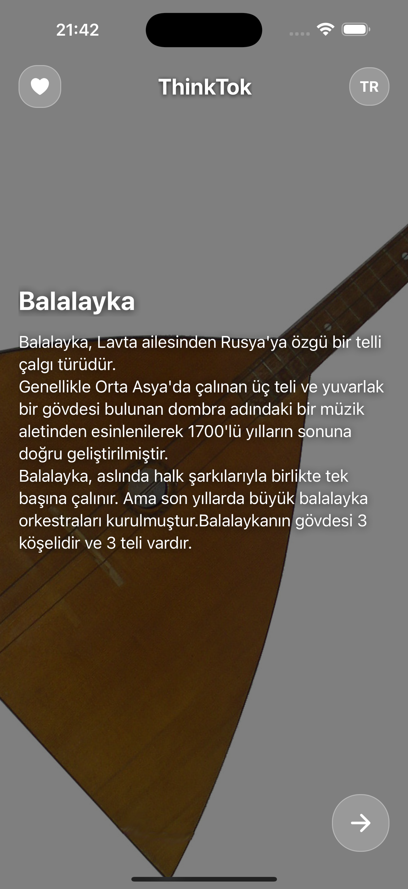
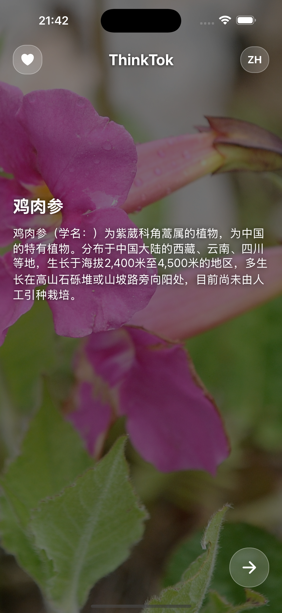
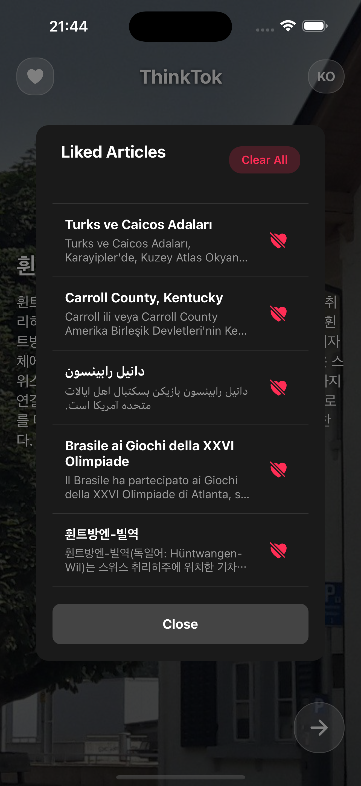
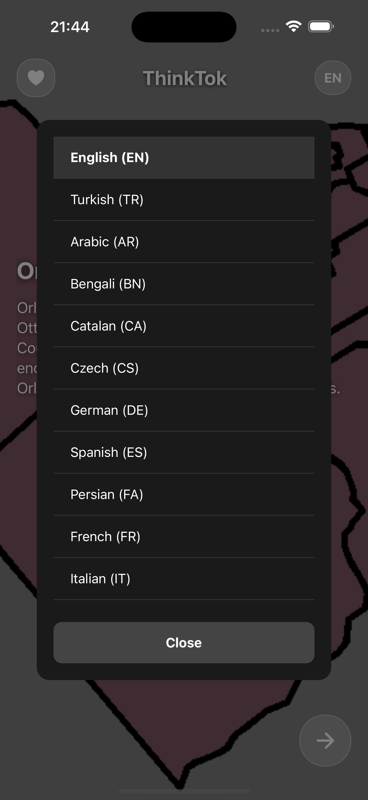

# Thinktok

## Introduction

Thinktok is designed to help users manage excessive screen time and reduce anxiety caused by constant exposure to negative news on social media. This application provides tools to curb doomscrolling habits and maintain a balanced digital lifestyle.

## Features

- Track time spent on social media.
- Provide insights and statistics on usage patterns.
- Offer gentle reminders and suggestions to take breaks.
- User-friendly interface enriched with sleek and engaging graphics.

## Screenshots

A selection of application screenshots:

|  |  |
| ---------------------------------------------- | ---------------------------------------------- |
|  |  |
|  |  |

## Installation

1. Clone the repository: `git clone https://github.com/armaganaysu/thinktok.git`
2. Navigate to the project directory: `cd thinktok`
3. Install dependencies: `npm install` or `yarn install`
4. Run the application: `npm start` or `yarn start`

## License

This project is licensed under the MIT License. 